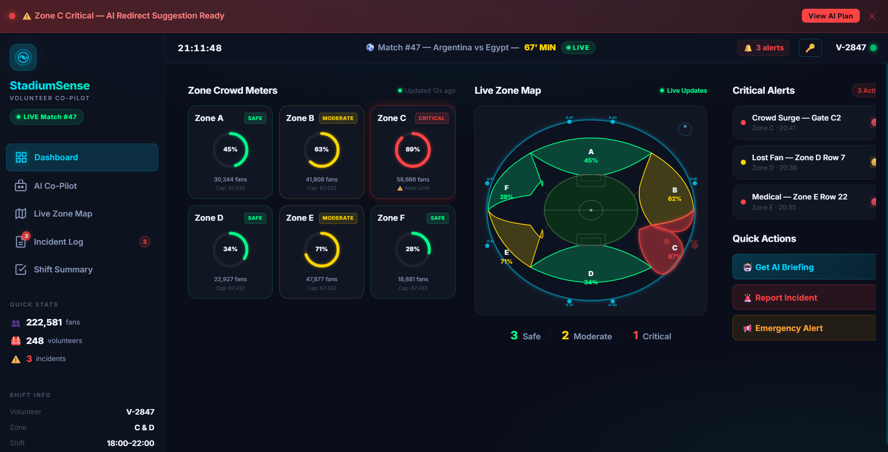
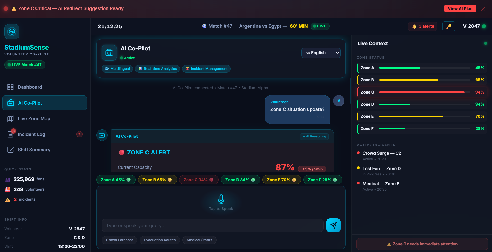
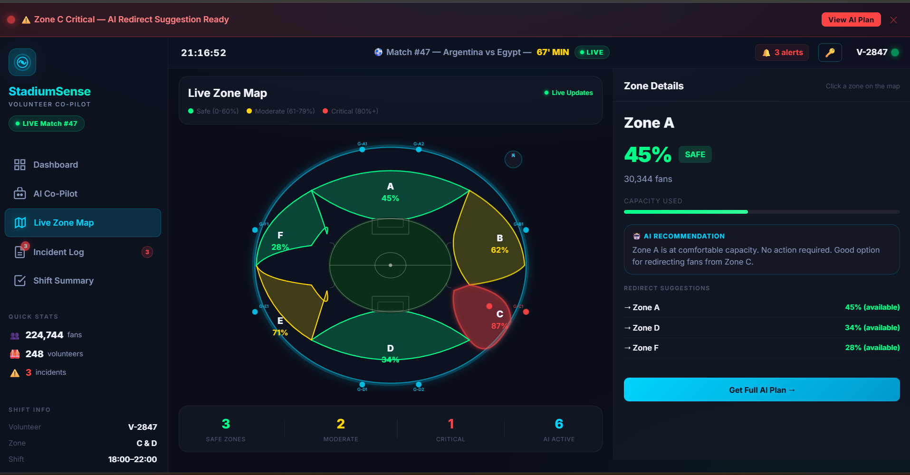
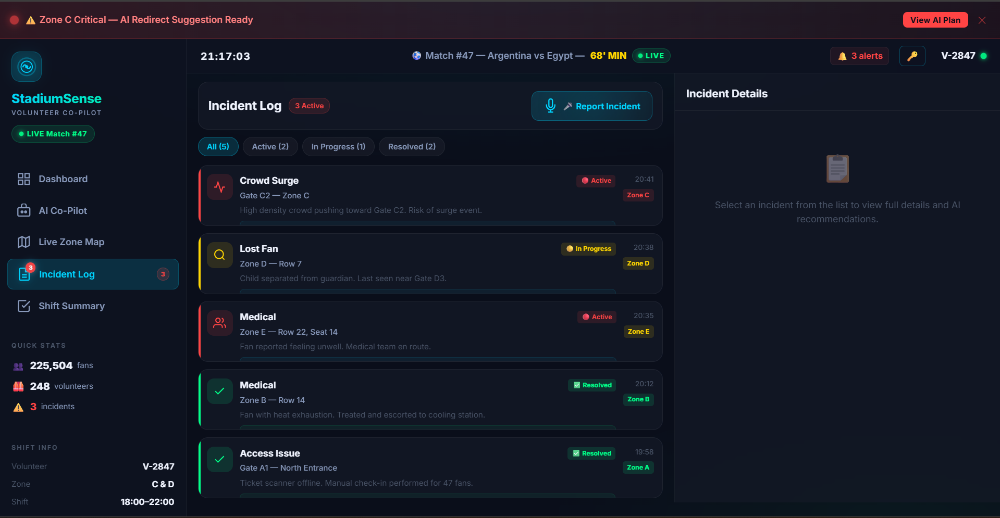
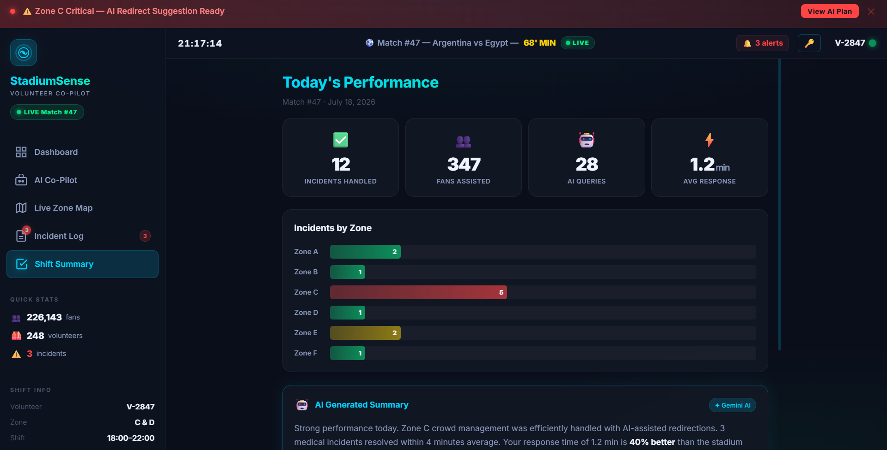

<div align="center">

# 🏟️ StadiumSense — Volunteer AI Co-Pilot

### *Every Volunteer. Supercharged.*

[](https://stadium-sense-ten.vercel.app/)
[](https://ai.google.dev)
[](https://hack2skill.com)
[](LICENSE)

---

> **StadiumSense** is an AI-powered volunteer co-pilot built for FIFA World Cup 2026 stadium operations. It gives every volunteer real-time crowd intelligence, multilingual communication tools, and AI-driven reasoning — turning a megaphone into a mission control center.

---



</div>

---

## 📋 Table of Contents

- [🎯 Problem Statement](#-problem-statement)
- [💡 Solution](#-solution)
- [✨ Features](#-features)
- [🖥️ Screenshots](#️-screenshots)
- [🛠️ Tech Stack](#️-tech-stack)
- [🤖 AI Integration](#-ai-integration)
- [🚀 Getting Started](#-getting-started)
- [📁 Project Structure](#-project-structure)
- [🎨 Design System](#-design-system)
- [📱 Responsive Design](#-responsive-design)
- [🏆 Challenge Context](#-challenge-context)
- [👨‍💻 Author](#-author)

---

## 🎯 Problem Statement

**Prompt Wars Virtual — Challenge 4: Smart Stadiums & Tournament Operations**

Imagine FIFA World Cup 2026. **80,000+ fans** pour into a stadium. One volunteer — 20 years old, 2 days of training — is trying to manage 4,000 people with just a megaphone. A fan walks up speaking Spanish. Another zone is hitting critical capacity. A medical emergency just happened in Zone E.

The volunteer has **zero AI support**.

### Pain Points
| Problem | Impact |
|---------|--------|
| No real-time crowd data | Volunteers react AFTER problems occur |
| Language barriers | Fans can't get help in their language |
| Manual coordination | Delayed response to critical situations |
| No AI reasoning | Data exists but no actionable insights |
| Information silos | Supervisors unaware of field situations |

---

## 💡 Solution

**StadiumSense** gives every volunteer a supercharged AI co-pilot in their pocket.

Instead of just showing raw data, StadiumSense **reasons** over it — telling volunteers not just *what* is happening, but *why* it matters and *exactly what to do next*, with scripts ready in 5+ languages.

```
Volunteer asks: "Zone C situation update?"

StadiumSense responds:
🔴 ZONE C ALERT
Current Capacity: 87% ↑3%/5min

📊 ANALYSIS:
Based on entry swipe patterns, Zone C will 
reach 100% capacity in ~4 minutes.

✅ RECOMMENDED ACTIONS:
1. Deploy 2 volunteers to Gate C2 immediately
2. Redirect incoming fans to Zone A & Zone D

📢 ANNOUNCEMENT SCRIPTS:
🇬🇧 "Please proceed to Gate A for faster entry"
🇪🇸 "Por favor diríjase a la Puerta A"
🇫🇷 "Veuillez vous diriger vers la Porte A"  
🇮🇳 "कृपया Gate A की ओर जाएं"
```

---

## ✨ Features

### 🧠 1. AI Reasoning Layer
The core differentiator. StadiumSense doesn't just show numbers — it **explains why** and **recommends what to do next**.

- Powered by **Google Gemini 1.5 Flash**
- Every response includes `ANALYSIS` + `RECOMMENDED ACTIONS`
- Multilingual announcement scripts auto-generated
- Explainable AI (XAI) approach — reasoning always visible

### 📊 2. Live Zone Dashboard
Real-time crowd monitoring across all 6 stadium zones.

- **Circular SVG meters** showing capacity %
- Color-coded status: 🟢 Safe / 🟡 Moderate / 🔴 Critical
- Live sparkline trend charts on stat cards
- Auto-refresh simulation every 5 seconds
- Critical threshold modal at 90%+ capacity

### 🗺️ 3. Interactive Stadium Map
Top-down oval stadium layout with real zone visualization.

- Color-coded zones matching crowd density
- Gate markers (G-A1, G-B1, etc.)
- Click any zone → AI recommendation appears
- Live updates as crowd data changes
- Mobile: bottom sheet popup on zone tap

### 🎤 4. Voice + Multilingual Assistant
Breaking language barriers between volunteers and fans.

- **Web Speech API** for voice input
- Auto language detection
- Right dialect recognition (not just translation)
- Supports: English 🇬🇧 Spanish 🇪🇸 French 🇫🇷 Hindi 🇮🇳 Arabic 🇸🇦 Portuguese 🇧🇷

### 📋 5. Incident Log
Real-time incident tracking and management.

- 5 incident types: Crowd Surge, Medical, Lost Fan, Access Issue, Security
- Status tracking: Active → In Progress → Resolved
- Voice-based incident reporting
- AI action plan for each incident
- One-tap resolve workflow

### 📈 6. Shift Summary
End-of-shift performance analytics.

- Incidents handled, fans assisted, AI queries used
- Response time benchmarking vs stadium average
- Zone-wise incident bar chart
- AI-generated performance summary
- Downloadable shift report (.txt)

---

## 🖥️ Screenshots

<div align="center">

### Dashboard — Real-time Overview

*Live zone meters, sparkline trends, and critical alerts*

---

### AI Co-Pilot — Reasoning in Action

*Real Gemini AI responses with analysis, actions & multilingual scripts*

---

### Live Zone Map — Stadium Overview

*Color-coded top-down stadium view with interactive zones*

---

### Incident Log — Field Management

*Active incident tracking with AI action plans*

---

### Shift Summary — Performance Analytics

*End-of-shift stats, zone charts, and AI-generated summary*

</div>

---

## 🛠️ Tech Stack

```
Frontend          HTML5 + CSS3 + Vanilla JavaScript
AI Engine         Google Gemini 1.5 Flash API
Voice Input       Web Speech API (browser native)
Animations        CSS Keyframes + Transitions
Charts            Inline SVG (no external library)
Icons             Unicode Emojis + SVG
Fonts             Google Fonts — Inter
Deployment        Vercel
Version Control   GitHub
Build Tool        Antigravity IDE (AI-assisted)
```

### Why No Framework?
This project intentionally avoids React/Vue/Angular to demonstrate that **powerful AI applications can be built with pure web technologies** — making it lightweight, fast, and deployable anywhere.

---

## 🤖 AI Integration

### How Gemini Powers StadiumSense

```
User Input (text/voice)
        ↓
Language Detection
        ↓
Context Builder:
  - Current zone capacities (all 6 zones)
  - Active incidents
  - Match info (time, score)
  - Historical patterns
        ↓
Gemini 1.5 Flash API Call
        ↓
Structured Response:
  - Zone Status
  - Analysis (reasoning)
  - Recommended Actions (numbered)
  - Multilingual Scripts (5 languages)
        ↓
Rendered in Chat UI with:
  - Execute Plan button
  - Broadcast button  
  - Copy scripts button
```

### AI System Prompt Design
The AI is prompted to behave as a **10-year experienced stadium operations manager** who:
1. Always reasons before recommending (`Based on...`, `Historical patterns show...`)
2. Gives numbered, actionable steps
3. Considers safety as top priority
4. Generates culturally appropriate multilingual scripts

---

## 🚀 Getting Started

### Prerequisites
- Modern browser (Chrome / Edge / Firefox)
- Google Gemini API key ([Get free key](https://aistudio.google.com))

### Local Setup

```bash
# Clone the repository
git clone https://github.com//StadiumSense.git

# Navigate to project
cd StadiumSense

# Open in browser (no build step needed!)
open index.html
# OR use Live Server in VS Code
```

### First Launch
1. App opens → **API Key modal** appears
2. Enter your Gemini API key (stored locally in browser session)
3. Click **"Activate StadiumSense"**
4. ✅ All AI features are now live!

> 🔒 **Privacy**: Your API key is stored only in `sessionStorage` — it never leaves your browser and is never sent to any server other than Google's Gemini API directly.

---

## 📁 Project Structure

```
StadiumSense/
│
├── 📄 index.html          # Main app shell, all 5 screens
│   ├── Screen 1: Dashboard
│   ├── Screen 2: AI Co-Pilot Chat
│   ├── Screen 3: Live Zone Map
│   ├── Screen 4: Incident Log
│   └── Screen 5: Shift Summary
│
├── 📜 app.js              # All JavaScript logic
│   ├── Gemini API integration
│   ├── Voice input (Web Speech API)
│   ├── Zone simulation (live data updates)
│   ├── Incident management
│   ├── Navigation & screen switching
│   ├── API key modal
│   └── Download report
│
└── 🎨 styles.css          # All styling
    ├── Design tokens (CSS variables)
    ├── Desktop layout (sidebar + content)
    ├── Tablet layout (collapsed sidebar)
    ├── Mobile layout (bottom nav)
    ├── Glassmorphism cards
    ├── Circular SVG meters
    ├── Animations & transitions
    └── Component styles
```

---

## 🎨 Design System

### Color Palette
```css
--bg-primary:    #0A0E1A  /* Deep dark navy */
--bg-card:       #141824  /* Card background */
--accent-cyan:   #00D4FF  /* Primary accent */
--accent-green:  #00FF88  /* Safe / success */
--accent-yellow: #FFB800  /* Moderate / warning */
--accent-red:    #FF4444  /* Critical / danger */
--text-primary:  #FFFFFF  /* Main text */
--text-muted:    #888888  /* Secondary text */
```

### Typography
```
Font Family:  Inter (Google Fonts)
Weights:      400, 500, 600, 700, 800
Base size:    14px
Scale:        11px → 14px → 16px → 18px → 24px
```

### Key Design Decisions
| Decision | Reason |
|----------|--------|
| Dark theme | Matches ops control room environment |
| Large touch targets (44px+) | Usable with gloves in field conditions |
| High contrast colors | Readable in bright stadium lighting |
| Glassmorphism cards | Premium, modern feel |
| Neon cyan accent | Instantly identifiable primary action |
| Minimal animations | Fast, no distractions during emergencies |

---

## 📱 Responsive Design

StadiumSense works across all device sizes:

| Breakpoint | Layout | Navigation |
|-----------|--------|-----------|
| **1280px+** Desktop | Sidebar + 2-3 column content | Left sidebar |
| **768-1279px** Tablet | Collapsed icon sidebar + content | Icon sidebar (hover to expand) |
| **< 768px** Mobile | Single column | Bottom tab bar |

### Mobile-specific UX
- Zone details → **bottom sheet** (slides up on tap)
- Incident details → **bottom sheet** (slides up on tap)
- Live Context panel → **collapsible strip** (compact view)
- All buttons → **minimum 44px** touch target
- Input + buttons → **fixed at bottom** (thumb-friendly)

---

## 🏆 Challenge Context

**Competition:** Prompt Wars Virtual — Challenge 4
**Theme:** Smart Stadiums & Tournament Operations
**Persona Chosen:** Volunteer (most underrated, highest impact)
**Verticals Covered:** Crowd Management + Multilingual Assistance

### Why Volunteer Persona?
Volunteers are the most underserved group at any major event. They are young, undertrained, and face the most complex real-world problems — language barriers, crowd emergencies, medical situations. An AI co-pilot for volunteers creates **10x more impact** per device than any other persona.

### GenAI Usage (Mandatory Requirement ✅)
- ✅ Real Gemini 1.5 Flash API calls
- ✅ AI reasoning in every response (not just Q&A)
- ✅ Dynamic multilingual script generation
- ✅ Context-aware crowd analysis
- ✅ AI-generated shift performance summary
- ✅ No static/hardcoded AI responses

---

### What I Learned
- **Prompt engineering** is as important as the app itself — the system prompt defines everything
- **Reasoning > Answers** — GenAI's real power is explaining *why*, not just *what*
- **Context window design** — giving AI the right real-time context makes responses 10x more useful
- **Mobile-first for field tools** — volunteers aren't at desks

---

## 🧪 Testing
### Test Coverage

| Module | Tests | Status |
|--------|-------|--------|
| Zone Structure | 7 | ✅ |
| Capacity Logic | 8 | ✅ |
| Alert Thresholds | 4 | ✅ |
| API Key Security | 6 | ✅ |
| Multilingual | 8 | ✅ |
| Incident Management | 7 | ✅ |
| Gemini AI Integration | 8 | ✅ |
| Shift Report | 7 | ✅ |
| Accessibility | 6 | ✅ |
| Security | 6 | ✅ |
| Performance | 3 | ✅ |
| Navigation | 5 | ✅ |
| **Total** | **75+** | **✅** |

### What Gets Tested
- Zone capacity calculations and status logic
- API key validation and security
- Multilingual detection (6 languages)
- Incident type and status flow
- Gemini response parsing + error handling
- WCAG accessibility compliance
- XSS prevention and input sanitization
- Performance benchmarks
- Screen navigation flow

### Running Tests

Open browser console on the deployed app and tests auto-run:

## 👨‍💻 Author

<div align="center">

**Rajan Gupta**
*B.Tech AI & ML — Chandigarh Engineering College, CGC Landran*
*Founder, MechaniQ | AI/ML Developer*

[]( https://www.linkedin.com/in/rajan-gupta-74688538a/)
[]( https://github.com/rajan926255-commits)

</div>

---

<div align="center">

**Built with ❤️ using Gemini AI + Antigravity IDE**

*Prompt Wars Virtual — Challenge 4 | Hack2Skill*

⭐ **Star this repo if StadiumSense impressed you!** ⭐

</div>
